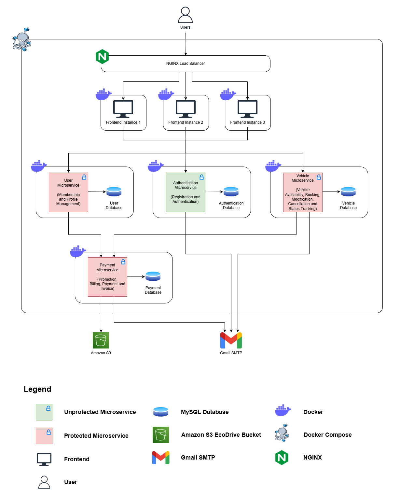
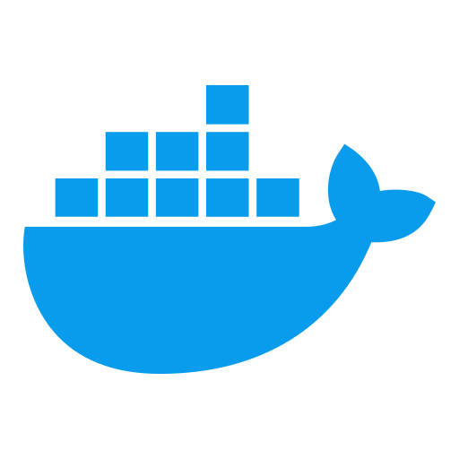
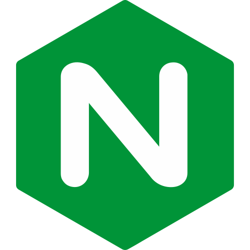

# EcoDrive Architecture Documentation

## Owner

Lee Guang Le, Jeffrey (S10258143A)

## Introduction

In the era of sustainable transportation, EcoDrive revolutionises urban mobility with a user-centric electric car-sharing platform. Designed for scalability and practicality, it features user membership tiers, promotional discounts, and precise billing. The architecture, as outlined in the diagram, ensures robust and efficient operations.

## Architecture Diagram

## Architectural Rationale

### **Microservices Architecture**

EcoDrive utilises a **microservices architecture** to ensure modularity, scalability, and ease of maintenance. Each microservice is independent and responsible for a specific business functionality. The key microservices include:

1. **User Microservice**:

   - **Functionality**: Handles membership management, including user profiles and membership tiers.
   - **Database**: Utilises MySQL with **indexes, optimised data types**, and adherence to **normalisation** for efficient data retrieval and minimal redundancy.

2. **Authentication Microservice**:

   - **Functionality**: Manages user registration and login processes.
   - **Database**: Stores user credentials in a normalised and optimised MySQL database.
   - **Integration**: Sends email verification via Gmail SMTP.

3. **Vehicle Microservice**:

   - **Functionality**: Tracks vehicle availability and manages booking, modifications, and cancellations.
   - **Database**: Uses MySQL with optimised schemas for vehicle data.
   - **Integration**: Sends booking confirmation and cancellation emails via Gmail SMTP.

4. **Payment Microservice**:
   - **Functionality**: Handles billing, promotional discounts, payments, and invoice generation.
   - **Database**: Manages transaction records in a MySQL database optimised for financial data storage.
   - **Integration**:
     - **Amazon S3**: Stores invoice PDFs for administrative purposes, enabling the admin to view all invoices.
     - **Gmail SMTP**: Sends refund confirmations and invoices to users.

### Technology Breakdown

  <table border="1" style="border-collapse: collapse; width: 100%; text-align: center;">
    <thead>
      <tr>
        <th><strong>Technology</strong></th>
        <th><strong>Description</strong></th>
      </tr>
    </thead>
    <tbody>
      <tr>
        <td>
          <strong>Go</strong> 
          
        </td>
        <td style="text-align: left;">The programming language used to develop EcoDrive's microservices, ensuring high performance, simplicity, and efficient concurrency handling.</td>
      </tr>
      <tr>
        <td>
          <strong>MySQL</strong> 
          
        </td>
        <td style="text-align: left;">
          Used for structured data storage with optimised database management practices, including:
          <ul style="text-align: left;">
            <li><strong>Indexes:</strong> Key fields are indexed to optimise query performance.</li>
            <li><strong>Normalisation:</strong> Adheres to eliminate data redundancy and maintain integrity.</li>
            <li><strong>Optimised Data Types:</strong> Improves storage efficiency and query execution.</li>
          </ul>
        </td>
      </tr>
      <tr>
        <td>
          <strong>Docker</strong> 
          
        </td>
        <td>Used to containerise each microservice, ensuring consistency across development and production environments.</td>
      </tr>
      <tr>
        <td>
          <strong>Docker Compose</strong> 
          
        </td>
        <td style="text-align: left;">
          Manages and deploys multiple interconnected containers:
          <ul style="text-align: left;">
            <li><strong>Containerisation:</strong> Each service runs in isolation.</li>
            <li><strong>Multi-Service Orchestration:</strong> Defines dependencies and networking.</li>
            <li><strong>Scalability:</strong> Allows independent scaling.</li>
            <li><strong>Environment Replication:</strong> Reduces deployment-related issues.</li>
          </ul>
        </td>
      </tr>
      <tr>
        <td>
          <strong>NGINX</strong> 
          
        </td>
        <td style="text-align: left;">Acts as a load balancer to distribute traffic among frontend instances, ensuring high availability and optimal utilisation of resources.</td>
      </tr>
      <tr>
        <td>
          <strong>Gmail SMTP</strong> 
          
        </td>
        <td style="text-align: left;">
          Integrated for email notifications, such as:
          <ul style="text-align: left;">
            <li><strong>Authentication Microservice:</strong> Email verification for account creation.</li>
            <li><strong>Vehicle Microservice:</strong> Booking refund confirmation.</li>
            <li><strong>Payment Microservice:</strong> Booking and membership confirmations and invoices.</li>
          </ul>
        </td>
      </tr>
      <tr>
        <td>
          <strong>Amazon S3</strong> 
          
        </td>
        <td style="text-align: left;">Exclusively used by the Payment Microservice to store invoice PDFs, enabling administrators to access and review user transactions securely.</td>
      </tr>
    </tbody>
  </table>

## Installation Guide

1. **Download Source Code**  
   Download the source code as a ZIP file from the provided repository link.

2. **Extract and Open**  
   Extract the ZIP file and open the project in your preferred Integrated Development Environment (IDE).

3. **Contact for Environment Files**  
   Reach out to Jeffrey via Telegram at [@cheeguang](https://t.me/cheeguang) to obtain the required environment files.

4. **Place Environment Files**  
   Place the environment files in their respective directories as instructed.

5. **Start Docker Desktop**  
   Ensure Docker Desktop is installed and running on your machine.

6. **Access the Application**  
   Open your browser and navigate to [http://127.0.0.1:8080/index.html](http://127.0.0.1:8080/index.html) to access the application.
